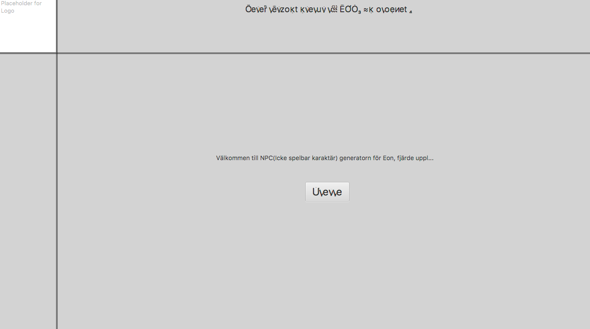

Input NPCmaker

-   I själva NPCmakern, uppdateras härledda egenskaper löpande om man ändrar
    grundfärdigheter? Kan vara en bra funktion. Tex jag är missnöjd med min NPCs
    styrka och ökar den, då verkar inte kroppsbyggnad förändras. Testade att
    sätta alla till noll och inget hände. Om det är för meckigt kan det vara
    värt att skriva typ (obs. härledda attribut uppdateras inte om grundattribut
    modifieras.

-   Lägga till prompt för om man inte skrivit i namn

-   Lägga till prompt för att berätta vad filen hamnat och vad den heter.

-   Om man skriver in något i primärt och sekundärt karaktärsdrag följer det
    inte med till pdf.

-   Konstig text när man öppnar i Mac, ser dock bra ut när man kommer till
    själva karaktären:

PDF

-   Cirklar vid avtrubbning går ej att avmarkera, spelar kanske ingen roll om
    man printar, men använder man det digitalt så kan det vara viktigt. Gör
    ”checkboxes” istället

-   Gruppera händelser utifrån vilken tabell de kommer ifrån, typ ha en kortare
    lista med överskrift för varje tabell (färder & äventyr, intriger & ….) samt
    ha siffran på händelsen så man kan hitta den lätt

-   Alternativt skriv (58, Färder & Äventyr) efter händelsen

-   Se till så att ”speciella egenskaper hamnar på samma rad som händelsen de
    hör ihop med, går att kombinera med ovan.

Exempel:

| **Händelser**        | **Speciella egenskaper** |
|----------------------|--------------------------|
| **Färder & äventyr** |                          |
| (58) Bla bla         |                          |
| (67) Bla             | \+T6 i derpity derp      |
|                      |                          |
|                      |                          |
| **Intriger &…**      |                          |
| (12) Blalbalabb      |                          |

-   Markera lättlärda färdigheter även på färdighetslistan, kanske ha en kolumn
    som heter ”lättlärd” med en checkbox vid varje färdighet (iof är det för
    NPCs, men det går ju att göra om den så den funkar för vanliga karaktärer
    också).

-   Du skulle kunna ha en titel på första sidan med lite större text, där namn
    och värv står? Så man ser direkt i stor text; Derp McDerpface – Krigare
